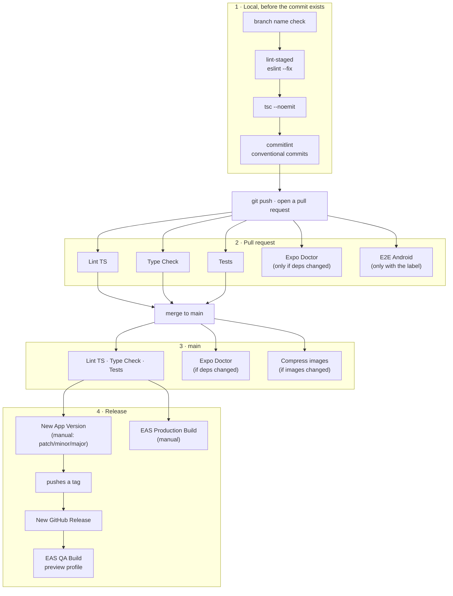

# my-app-template

Opinionated Expo template for building responsive, multi-platform apps (phone and tablet, iOS and Android).

Built on the **[Obytes React Native / Expo starter](https://github.com/obytes/react-native-template-obytes)** (v9.0.0), then trimmed to a single start screen with no authentication, upgraded to Expo SDK 57, and documented in [`docs/`](./docs/README.md).

The project structure, the CI workflows and most of the tooling choices come from Obytes — credit where it is due. What changed here is scope: everything that was an example was removed, so the first feature you write is the first feature in the app.

## Stack

| Concern | Choice |
| --- | --- |
| Runtime | Expo SDK 57, React Native 0.86, React 19.2 |
| Routing | Expo Router 57 (file-based, typed routes) |
| Styling | Uniwind + Tailwind CSS 4 (`className`, theme via CSS `@theme`) |
| Server state | TanStack Query 5 + axios |
| Client state | Zustand 5 |
| Storage | react-native-mmkv 4 |
| i18n | i18next + react-i18next — `en-US` (default) and `pt-BR` |
| Unit tests | Jest + React Testing Library |
| E2E | Maestro |
| Lint & format | ESLint (`@antfu/eslint-config`, formatting via ESLint Stylistic — no Prettier) |
| Language | TypeScript 6, strict |
| Package manager | pnpm |

## Getting started

```bash
pnpm install
pnpm start            # dev server
pnpm ios              # run on iOS simulator
pnpm android          # run on Android emulator
```

This template uses an Expo custom dev client, so Expo Go is not supported. Build and install the dev client first.

## Editor

`.vscode/` is configured for this project: ESLint fixes on save, Prettier explicitly disabled, Tailwind IntelliSense pointed at `src/global.css` (Tailwind 4 keeps its theme in CSS), and i18n-ally pointed at `src/translations/`.

Install the recommended extensions when prompted, and accept the prompt to use the workspace TypeScript — the project is on TypeScript 6 and the editor's bundled version may be older.

`project.code-snippets` carries prefixes that follow the conventions: `screen`, `route`, `comp`, `test`, `store`, `useq`, `useqv`, `usem`, `useiq`, `nav`.

## Quality gates

```bash
pnpm lint             # eslint
pnpm type-check       # tsc --noemit
pnpm test             # jest
pnpm check-all        # all of the above + translation lint
pnpm e2e-test         # maestro flows (requires a running emulator)
```

Every change is written test-first. **[`docs/workflow.md`](./docs/workflow.md) is the development loop** — how a change goes from an idea to a merge — and the rest of the conventions live in [`docs/`](./docs/README.md).

## CI/CD

Four stages. The first runs on your machine, the rest on GitHub Actions.



### 1 · Local, before the commit exists

Husky runs these on `pre-commit` and `commit-msg`. A commit that would fail CI never gets created.

| Step | What it does |
| --- | --- |
| branch name check | rejects a branch that is not `feat/`, `fix/`, `chore/`, `docs/`, `refactor/`, `test/` or `ci/` |
| `lint-staged` | `eslint --fix` on staged files |
| `tsc --noemit` | type-checks the project |
| `commitlint` | enforces Conventional Commits |

`pnpm check-all` runs the same checks plus the tests, on demand.

### 2 · Pull request

| Workflow | Runs | Blocking |
| --- | --- | --- |
| `lint-ts.yml` | `eslint .`, annotated inline by reviewdog | yes |
| `type-check.yml` | `tsc --noemit`, annotated inline | yes |
| `test.yml` | `jest`, with the summary posted as a comment | yes |
| `expo-doctor.yml` | only when `package.json` or `pnpm-lock.yaml` changed | yes, when it runs |
| `e2e-android.yml` | Maestro on an emulator — **only** if the PR carries the `android-test-github` label | opt-in |

E2E is opt-in because a full Android build plus emulator run costs roughly fifteen minutes. Add the label when a change touches navigation, startup or anything a unit test cannot reach.

### 3 · main

The same three gates re-run after the merge, plus two housekeeping jobs: `expo-doctor.yml` when dependencies moved, and `compress-images.yml` when an image was added.

### 4 · Release

The chain is automatic once you start it:

1. **New App Version** — run it by hand from the Actions tab and pick `patch`, `minor` or `major`. It bumps the version, runs prebuild so the native version matches, and pushes a tag.
2. **New GitHub Release** — fires on the pushed tag and publishes the release.
3. **EAS QA Build** — fires when the release is published and builds the `preview` profile for both platforms.

**EAS Production Build** stays manual and separate, so nothing ships to a store by accident.

One catch worth knowing before you rely on step 2 firing: a push made with the automatic `GITHUB_TOKEN` does **not** trigger other workflows. If `GH_TOKEN` is not set, *New App Version* still pushes its tag, but *New GitHub Release* never wakes up and the chain stops there. Supply a personal access token as `GH_TOKEN` to make it run end to end.

Both EAS workflows need an `EXPO_TOKEN` secret, and `app.config.ts` ships with `EXPO_ACCOUNT_OWNER` and `EAS_PROJECT_ID` empty on purpose. Until those are filled in, the release stages are inert — the pull-request gates work with no configuration at all.

Full detail, including every secret and what it is for, in [`docs/ci/workflows.md`](./docs/ci/workflows.md).

## What ships

A single route rendering one screen: a centred title built from the app name plus `Starter`, a one-line description, and two round toggles in the top-right that flip the theme and the language in place. There is no authentication, no tab bar and no example feature — the first feature you add is the first feature in the app.

Dark is the theme a fresh install starts on, and `en-US` is the starting language.

`src/components/ui` is trimmed to what the screen actually renders — `Text`, the focus-aware status bar, the theme mapping and the React Native re-exports. The infrastructure underneath is untouched and fully wired: HTTP client, query provider, MMKV storage, i18n, theming, testing and CI.

Everything removed along the way — data fetching, Zustand stores, forms, settings rows, the button, input, checkbox, select and modal components — is preserved verbatim in [`docs/reference/removed-patterns.md`](./docs/reference/removed-patterns.md). Copy a pattern back when you need it instead of rewriting it.

## Project structure

```
src/
├─ app/            # Expo Router routes — thin re-exports only
├─ features/       # one folder per domain: screen, components/, api.ts, store
├─ components/ui/  # design system
├─ lib/            # infrastructure: api client, i18n, storage, hooks
└─ translations/   # en-us.json, pt-br.json
```

Dependency rule — imports only flow to the right:

```
app/  →  features/  →  components/ui/  →  lib/
```

A feature never imports another feature. Shared code moves up into `lib/` or `components/ui/`.

## Environments

`env.ts` recognises three environments — `development`, `preview` and `production` — and each one selects its own bundle id, package name and URL scheme.

Expo only loads the standard dotenv files (`.env`, `.env.local`, `.env.[NODE_ENV]`, `.env.[NODE_ENV].local`), and the Expo docs recommend against switching environments through `NODE_ENV`. So the per-environment files here are **examples**, not files Expo reads. Pick one before your first run:

```bash
pnpm env:use development   # or preview / production
pnpm start --clear
```

That copies the matching example onto `.env.local`, which Expo loads with precedence.

| File | Tracked | Purpose |
| --- | --- | --- |
| `.env.development.example` | yes | template for local development |
| `.env.preview.example` | yes | template for preview / QA |
| `.env.production.example` | yes | template for production values |
| `.env.local` | no | the environment you are actually running |

**No `.env` is committed, and `.gitignore` refuses every `.env*` that is not an `.example`.** A tracked env file is one careless edit away from putting a real credential in git history, and history is public the moment the repository is.

EAS builds do not use these files: `eas.json` sets `EXPO_PUBLIC_APP_ENV` per build profile and reads the rest from the matching EAS environment.

Never put a real secret in an `EXPO_PUBLIC_` variable — those are inlined in plain text into the app bundle.

## Before shipping a real app

- `app.config.ts` — set `EXPO_ACCOUNT_OWNER` and `EAS_PROJECT_ID` (both are intentionally empty)
- `env.ts` — rename `NAME`, `BUNDLE_IDS`, `PACKAGES`, `SCHEMES`
- `.env.*.example` — point `EXPO_PUBLIC_API_URL` at a real API, then `pnpm env:use <environment>`

## Git workflow

`main` is the only long-lived branch. Every change starts from it on a new branch named `feat/…`, `fix/…`, `chore/…`, `docs/…`, `refactor/…`, `test/…` or `ci/…`, and lands through a pull request. Commits follow Conventional Commits, enforced by commitlint.
