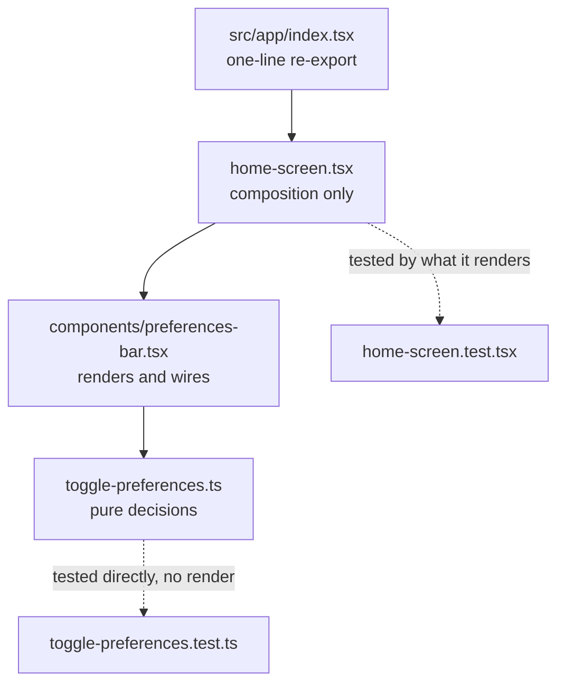
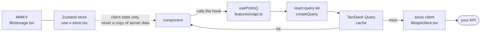

# Data flow

Nothing in the app fetches data yet. This describes the wiring that is already in place and the shape a feature should take when it starts using it.

## Route to screen



The split matters for testing: `toggle-preferences.ts` holds the decisions and is tested without rendering anything, while the component is tested for what it renders.

## Server state




`src/lib/api` is already wired: `client.tsx` is an axios instance pointed at `EXPO_PUBLIC_API_URL`, and `provider.tsx` supplies the TanStack Query client, mounted in `src/app/_layout.tsx`.

A feature adds an `api.ts` and nothing else:

```ts
import type { AxiosError } from 'axios';
import { createQuery } from 'react-query-kit';
import { client } from '@/lib/api';

type Post = { id: number; title: string };

export const usePosts = createQuery<Post[], void, AxiosError>({
  queryKey: ['posts'],
  fetcher: () => client.get('posts').then(response => response.data),
});
```

`react-query-kit` is installed for this. It turns a query into a named hook with a typed key, so call sites read `usePosts()` instead of assembling `useQuery` options by hand.

Server state stays in TanStack Query. Do not copy it into a Zustand store — you would own cache invalidation by hand from then on.

## Client state

Zustand, one store per feature, in `use-<name>-store.tsx`. Wrap it with `createSelectors` from `@/lib/utils`:

```ts
export const useAuthStore = createSelectors(_useAuthStore);
```

That gives `useAuthStore.use.status()`, which subscribes to a single slice. Subscribing to the whole store re-renders every consumer on every change.

Reach for a store only when state outlives a screen. Inside one screen, `useState` is the right answer.

## Persistence

`src/lib/storage.tsx` wraps MMKV with `getItem` / `setItem` / `removeItem`, JSON-encoded. It is synchronous, so it can be read at module scope — that is how the selected theme is applied before the first render.

MMKV is not encrypted here. Tokens and secrets belong in `expo-secure-store`.

## Translations

Every user-facing string goes through `translate('key')`, or through the `tx` prop on `Text`. Keys are typed from `en-us.json`, so an unknown key is a compile error rather than a blank label. See [../guides/environment.md](../guides/environment.md) for how locales are selected.

A full working example of all four — query, mutation, store, form — is preserved in [../reference/removed-patterns.md](../reference/removed-patterns.md).
