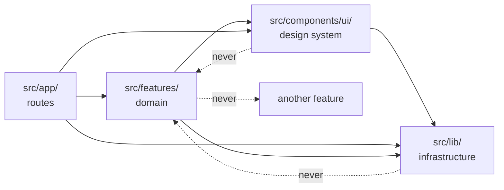

# Architecture overview

## Layers

```
src/app/            routes         what URL exists
src/features/       domain         what the app does
src/components/ui/  design system  what it looks like
src/lib/            infrastructure what it runs on
```

## The dependency rule

Imports flow in one direction only:



Solid arrows are allowed. Dotted arrows are the imports that break the architecture.

- `app/` may import anything.
- `features/` may import `components/ui/` and `lib/`.
- `components/ui/` may import `lib/`, never a feature.
- `lib/` imports nothing from the layers above it.
- **A feature never imports another feature.**

That last rule is the one that decays first. When two features need the same thing, the answer is never a cross-import — it is to move the shared piece up. Domain-free UI goes to `components/ui/`, everything else to `lib/`.

The rule exists because cross-feature imports make features impossible to delete. This template is built to be copied and stripped down, and a feature you cannot delete in one `rm -rf` has failed at its job.

## Why routes are re-exports

Every file in `src/app/` is a single line:

```tsx
export { HomeScreen as default } from '@/features/home/home-screen';
```

Expo Router derives the navigation tree from the file system, so `src/app/` is really configuration. Keeping logic out of it means the URL structure can be reorganised without touching a screen, and a screen can be tested without a router.

## What the app currently is

One route. `src/app/index.tsx` re-exports `HomeScreen`, which renders a GitHub avatar and handle, a title, a description and two toggles for theme and language. There is no authentication, no tab bar, no data fetching — the avatar is a plain remote image, not a request.

That is deliberate. The infrastructure below is fully wired — HTTP client, query provider, storage, i18n, theming, testing, CI — but nothing in it is spent on an example you would have to delete first. See [reference/removed-patterns.md](../reference/removed-patterns.md) for the working code this template used to ship.
