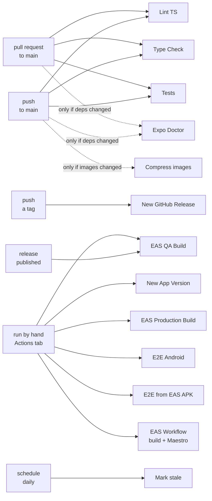
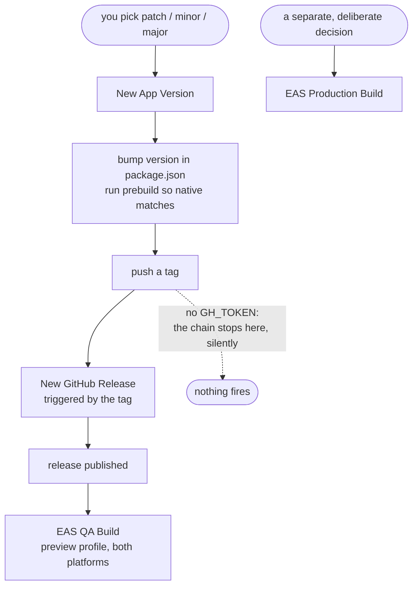

# CI workflows

Twelve workflows in `.github/workflows/`. Only three run on an ordinary pull request; the rest are manual, event-driven or gated behind a label.

## What triggers what



Solid arrows always fire. Dotted arrows depend on a condition — a changed path, or a label on the pull request.

## On every pull request


| Workflow | Runs | Fails when |
| --- | --- | --- |
| `lint-ts.yml` | `eslint .` | a lint or formatting rule is broken |
| `type-check.yml` | `tsc --noemit` | types do not check |
| `test.yml` | `jest` | a unit test fails |

These three are the gate. They need no secret and finish in a couple of minutes. If you protect `main` with required status checks, these are the ones to require.

## Conditional

| Workflow | Trigger |
| --- | --- |
| `expo-doctor.yml` | pull request touching `package.json` or `pnpm-lock.yaml` |
| `e2e-android.yml` | manual only |
| `e2e-android-eas-build.yml` | manual, takes an EAS APK URL |
| `.eas/workflows/e2e-test-android.yml` | manual, via `eas workflow:run` |
| `compress-images.yml` | pull request touching images |
| `stale.yml` | schedule |

## Release

| Workflow | Trigger | Needs |
| --- | --- | --- |
| `new-app-version.yml` | manual: patch, minor or major | `GH_TOKEN`, optional |
| `new-github-release.yml` | a pushed tag | — |
| `eas-build-qa.yml` | a published release, or manual | `EXPO_TOKEN` |
| `eas-build-prod.yml` | manual only | `EXPO_TOKEN` |

Those four form a chain:



*New App Version* bumps the version and pushes a tag, the tag publishes a GitHub release, and the published release starts the QA build. Production stays manual and outside the chain, so nothing reaches a store without someone deciding it should.

The chain has one failure mode that looks like nothing happening at all. A push made with the automatic `GITHUB_TOKEN` does not trigger other workflows, so without a `GH_TOKEN` the tag lands and *New GitHub Release* never fires.

## Secrets

| Secret | Used by | What it is | Required |
| --- | --- | --- | --- |
| `EXPO_TOKEN` | both EAS build workflows | an access token from [expo.dev/settings/access-tokens](https://expo.dev/settings/access-tokens); authenticates `eas build` | yes, for any EAS build |
| `GH_TOKEN` | `new-app-version.yml` | a PAT with repository write, used to push the version bump and tag | no |

`GITHUB_TOKEN` appears in several workflows and is injected automatically — do not add it.

`GH_TOKEN` is optional because the workflow falls back to `GITHUB_TOKEN`. The difference matters at the edge: a push made with `GITHUB_TOKEN` does not trigger other workflows, so a tag created that way will not start the release build. Supply a PAT if you want that chain to fire.

Nothing here uses `MAESTRO_CLOUD_API_KEY`. Maestro Cloud is paid and this template does not depend on it.

## Before the first EAS build

`app.config.ts` ships with `EXPO_ACCOUNT_OWNER` and `EAS_PROJECT_ID` empty on purpose. Fill both in — `eas init` generates the project id — or every EAS workflow fails at authentication.

## Environments

`APP_ENV` in a workflow must name a profile that exists in `eas.json`: `development`, `preview`, `production` or `simulator`. The upstream template used `staging`, which does not exist here — that mismatch made `pnpm prebuild:staging` fail and is worth remembering if you copy a workflow from elsewhere.

## The Node version is pinned for a reason

`.github/actions/setup-node-pnpm-install` asks for **Node 24**. Do not move it to 22.

`pnpm prebuild` fails there, on Linux, and only there:

```
Error: [android.dangerous]: withAndroidDangerousBaseMod:
       Could not find MIME for Buffer <null>
    at Jimp.parseBitmap (node_modules/jimp-compact/dist/jimp.js)
```

It was isolated on this repository with one variable — the same tree and the same actions, changing only `node-version`. 20 passes, 22 fails after twelve seconds, 24 passes. macOS is unaffected: the same prebuild runs clean there on Node 22.

The failure comes from `@expo/image-utils`, which pins `jimp-compact@0.16.1`. That pin is in the latest published version, so there is nothing upstream to upgrade to. Every development prebuild passes through it, because `app-icon-badge` in `app.config.ts` badges the icons for any environment that is not production.

Node 20 also works and is out of support, which is why 24 is the one written down.

## Running a check locally

Everything the gate does, `pnpm check-all` does:

```bash
pnpm check-all   # lint + type-check + translation lint + tests
```

Run it before pushing and CI stops being a surprise.
