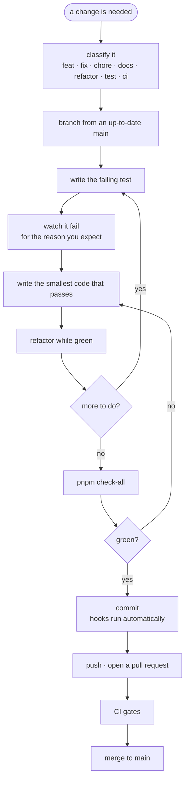

# Development workflow

The loop every change goes through, whatever its size. Read this before your first commit; it is also the document an AI agent should read first.



## 1 · Classify the change

The prefix is not decoration. It sets the branch name, the commit type and the reviewer's expectations, and a Husky hook rejects anything outside the list.

| Type | For | Needs a test? |
| --- | --- | --- |
| `feat` | new behaviour a user can observe | yes, written first |
| `fix` | a bug | yes — one that reproduces the bug before the fix |
| `refactor` | behaviour unchanged, structure improved | no new test; existing ones must stay green untouched |
| `test` | tests only | it is the test |
| `chore` | dependencies, tooling, config | only if it changes behaviour |
| `docs` | documentation only | no |
| `ci` | pipeline only | no |

If a change does not fit one type, it is more than one change. Split it. A branch that both fixes a bug and refactors around it produces a diff nobody can review, and a revert that undoes more than intended.

## 2 · Branch

```bash
git checkout main
git pull
git checkout -b feat/checkout-summary
```

Always from an up-to-date `main`, never from another feature branch. Names are `<type>/<short-kebab-description>`.

## 3 · Test first — and differently per type

**For a feature**, the test describes the behaviour you are about to add.

**For a bug fix, the test reproduces the bug.** Write it, run it, and confirm it fails *the way the bug fails*. That is the only proof you have understood the defect rather than guessed at it — and it is what stops the bug coming back later, because a passing test that never failed would not have caught it either.

```bash
./node_modules/.bin/jest src/features/checkout --forceExit
```

Watch the failure. A test that has never failed proves nothing: it may be asserting on the wrong element, or passing because of a typo in your assertion.

Pure decisions belong in a plain module, tested directly without rendering — `toggle-preferences.ts` is the example. When a component test feels awkward to write, that is usually a decision asking to be extracted.

Details in [testing/unit.md](./testing/unit.md).

## 4 · Write the code

The rules that matter while writing, each with the reason:

| Rule | Why |
| --- | --- |
| Imports flow `app/ → features/ → components/ui/ → lib/` | a feature you cannot delete in one `rm -rf` has failed at its job |
| A feature never imports another feature | move the shared piece up to `lib/` or `components/ui/` instead |
| No barrel `index.ts` inside a feature | it puts the whole feature in one refresh boundary and you lose state on every save |
| A route file is a one-line re-export | the URL tree can be reorganised without touching a screen |
| Every user-facing string goes through `translate` | and the key must exist in **every** locale, or the translation lint fails |
| Styling is Tailwind classes; colours are `@theme` tokens | an inline hex cannot follow the theme and cannot be found by search |
| Never edit `ios/` or `android/` | they are generated; use a config plugin in `app.config.ts` |

Full detail in [conventions/](./conventions/imports.md) and [architecture/overview.md](./architecture/overview.md).

## 5 · Verify before committing

```bash
pnpm check-all      # lint + type-check + translation lint + tests
```

This is the same set CI runs. Running it locally is the difference between finding a problem in ten seconds and finding it in ten minutes.

**Green on your machine is not proof it is green on a clean clone.** Generated files that are git-ignored — `expo-env.d.ts`, `.expo/` — exist here and not in CI. When a change touches `tsconfig.json`, types, or anything about how the project resolves modules, verify the way CI sees it:

```bash
mv expo-env.d.ts /tmp/ && mv .expo /tmp/
pnpm type-check
mv /tmp/expo-env.d.ts . && mv /tmp/.expo .
```

That exact gap once produced five CI errors that were invisible locally.

## 6 · Commit

```bash
git add -A
git commit -m "fix(auth): stop refreshing the token on every render"
```

Conventional Commits, enforced by commitlint. **The subject says what changes; the body says why.** What changed is already in the diff — the reasoning is the part that is lost otherwise, and it is what someone reads six months later while deciding whether they can undo your line.

The hooks run automatically: branch name, `eslint --fix` on staged files, `tsc --noemit`, then commitlint. Never reach for `--no-verify`. If a hook is wrong, fix the hook.

## 7 · Pull request

```bash
git push -u origin feat/checkout-summary
```

Lint, type-check, unit tests and the Maestro end-to-end flows all gate the merge. The E2E runs automatically on two paths — one on a GitHub emulator, one on EAS — so nothing is opt-in any more.

The description should say **why**, and call out anything you decided not to do. See [ci/workflows.md](./ci/workflows.md) for the whole pipeline.

## 8 · After the merge

Delete the branch, locally and on the remote. Releases are a separate, deliberate act — [ci/workflows.md](./ci/workflows.md#release).

## Definition of done

- [ ] Change fits exactly one type
- [ ] Branch cut from an up-to-date `main`
- [ ] Test written first and **seen failing**
- [ ] For a bug: the test reproduced the bug before the fix existed
- [ ] No import from another feature, no barrel inside a feature
- [ ] Routes are still one-line re-exports
- [ ] Strings translated in every locale
- [ ] `pnpm check-all` green
- [ ] Commit subject imperative, body explains why
- [ ] Anything left undone is stated in the pull request

## For AI agents

Read this file, then [architecture/overview.md](./architecture/overview.md) and [conventions/imports.md](./conventions/imports.md), before changing anything.

Two failure modes worth naming, because both have already happened in this repository:

**Do not assume a package is available because an import resolves.** `@react-navigation/native` worked for months without being declared — `.npmrc` sets `node-linker=hoisted`, so transitive packages resolve from the root. It broke the moment a dependency changed. If you import it, declare it.

**Do not report success from a check you did not run.** State what was verified and what was not. "Type-check passes" and "the app builds" are different claims, and a green `tsc` on code the bundler rejects is worth nothing.
